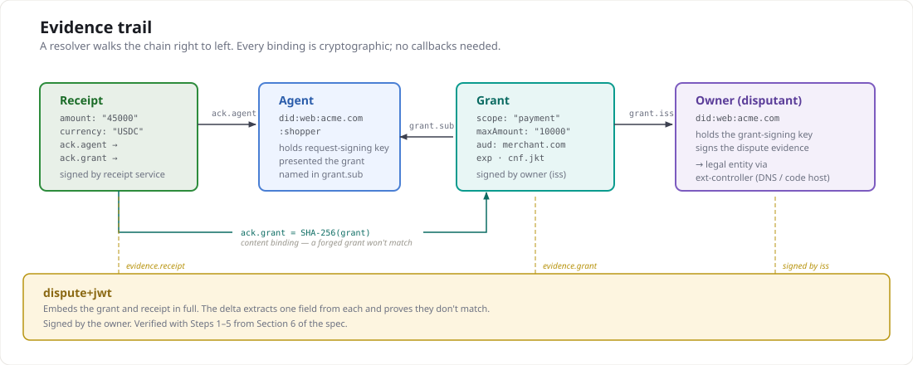

**Status: proposal draft.**

The key words MUST, MUST NOT, SHOULD, SHOULD NOT, and MAY
are used as defined in [RFC 2119](https://datatracker.ietf.org/doc/html/rfc2119).

# ext-disputes: dispute evidence for agent payments

This document layers on ACK-Pay core. It assumes the reader is familiar
with the `ack` binding (pay core Section 4), artifact references
(ACK-ID core Section 4.2), and grants (ACK-ID core Section 5).

## 1. Scope

This extension defines:

- A **dispute evidence artifact** — a signed JWT that packages the
  authorization scope (the grant), the action (the receipt), and a
  machine-readable description of the mismatch between them.
- **Reason codes** specific to agent commerce — the cases where an
  agent acted on a user's behalf but the action fell outside the
  authorized scope.
- A **verification checklist** for dispute evidence — what a resolver
  MUST check before treating the evidence as valid.

This extension does NOT define:

- **Resolution outcomes.** Whether a dispute leads to a refund,
  credit, or arbitration is a business layer above the protocol.
- **Intent capture.** A grant encodes authorization scope, not
  natural-language user intent. Capturing conversational intent
  is a harder problem worth a separate extension.
- **Fund reversal.** ACK receipts are attestations, not settlement
  instructions. Actual fund movement is the payment network's
  responsibility.
- **Multi-hop delegation.** If Agent A delegates to Agent B, the
  grant chain deepens. This extension assumes a single
  agent-to-owner grant.

The cost, stated openly: this extension adds one new artifact type and
one new verification path. It requires both parties to retain their
grant and receipt — the offer-retention question that pay core's open
decision #2 raises. An agent that discards the grant after payment
cannot later produce dispute evidence, and the protocol has no
re-issuance mechanism.

## 2. Terminology

- **Disputant** — the owner who authorized the grant and disputes
  the payment. The disputant is always the grant issuer.
- **Dispute evidence** — the signed artifact that packages the
  authorization-versus-action mismatch.
- **Delta** — a structured, machine-readable description of which
  grant constraint was violated and how.
- **Resolver** — any party that verifies dispute evidence. May be
  human, automated, or a combination.

## 3. Evidence trail

The dispute evidence artifact binds three signed objects into one
verifiable chain. A resolver walks the chain right to left; every
arrow is a cryptographic binding (signature or artifact reference).



The `grant_ref` binds by content (SHA-256 of the grant's compact
serialization, matching the receipt's `ack.grant`). The `receipt_ref`
binds by content (SHA-256 of the receipt's compact serialization).
Both the grant and receipt are embedded in full, so a resolver need
not fetch anything — the evidence is self-contained.

## 4. The dispute evidence artifact

A dispute evidence artifact is a JWS compact serialization signed by
the disputant (the grant issuer). The protected header carries
`typ: "dispute+jwt"` (per RFC 7515 §4.1.9, following core's
convention for artifact-typed JWTs). The payload carries:

```
-- Protected header --
{
  "alg": "EdDSA",
  "typ": "dispute+jwt",
  "kid": "<disputant's key thumbprint>"
}

-- Payload --
{
  "iss": "did:web:acme.com",
  "sub": "did:web:acme.com:shopper",
  "iat": 1726531200,
  "exp": 1727136000,
  "jti": "urn:uuid:550e8400-e29b-41d4-a716-446655440000",
  "reason": "scope-exceeded",
  "grant_ref": "kQ3v8Zt...",
  "receipt_ref": "pL9m2Xw...",
  "evidence": {
    "grant": "eyJhbGciOi...",
    "receipt": "eyJhbGciOi...",
    "delta": [
      {
        "field": "constraints.maxAmount",
        "authorized": "10000",
        "actual": "45000",
        "currency": "USDC"
      }
    ]
  }
}
```

The example is non-normative. The normative claim table follows.

### 3.1 Header

| Parameter | Requiredness | Rule |
|---|---|---|
| `typ` | REQUIRED | MUST be `dispute+jwt`. |
| `kid` | REQUIRED | The disputant's key thumbprint (JWK Thumbprint, RFC 7638). |

### 3.2 Payload claims

| Claim | Requiredness | Rule |
|---|---|---|
| `iss` | REQUIRED | The disputant's identity (an HTTPS URL). MUST match the grant's `iss`. |
| `sub` | REQUIRED | The agent's identity. MUST match the grant's `sub` and the receipt's `ack.agent`. |
| `iat` | REQUIRED | When the dispute was filed. |
| `exp` | REQUIRED | Evidence expiry. A resolver MUST reject expired evidence. SHOULD be no more than 90 days after `iat`. |
| `jti` | REQUIRED | Unique identifier for this dispute. |
| `reason` | REQUIRED | A reason code from the registry (Section 5). |
| `grant_ref` | REQUIRED | Artifact reference to the grant: SHA-256 of the grant JWT's compact serialization, base64url-encoded. MUST match the `ack.grant` value in the receipt. |
| `receipt_ref` | REQUIRED | Artifact reference to the receipt: SHA-256 of the receipt JWS compact serialization, base64url-encoded. |
| `evidence` | REQUIRED | Object containing `grant`, `receipt`, and `delta` (Section 4.3). |

### 3.3 Evidence object

| Field | Requiredness | Rule |
|---|---|---|
| `evidence.grant` | REQUIRED | The full grant JWT compact serialization. Its SHA-256 MUST match `grant_ref`. |
| `evidence.receipt` | REQUIRED | The full receipt JWS compact serialization. Its SHA-256 MUST match `receipt_ref`. |
| `evidence.delta` | REQUIRED | Array of one or more delta entries (Section 4.4). |

### 3.4 Delta entries

Each delta entry describes one constraint violation:

| Field | Requiredness | Rule |
|---|---|---|
| `field` | REQUIRED | Dot-path into the grant's claims identifying the violated constraint (e.g. `constraints.maxAmount`, `aud`, `exp`, `scope`). |
| `authorized` | OPTIONAL | The value from the grant. MUST be present when the grant contained the field. Omitted only for `no-grant` reason. |
| `actual` | REQUIRED | The corresponding value from the receipt or the payment request embedded in the receipt. |
| `currency` | OPTIONAL | Present when `field` references an amount, to make the delta self-contained. |

A resolver MUST independently verify that each delta entry is
mathematically correct by extracting the named field from the
embedded grant and receipt. A delta entry that does not match the
embedded artifacts is evidence of a fabricated dispute, and the
resolver MUST reject the entire artifact.

## 5. Reason code registry

| Code | When to use | Required delta fields |
|---|---|---|
| `scope-exceeded` | The action violated a mechanically verifiable grant constraint — amount, recipient, or any constraint whose value appears in both the grant and the receipt's embedded payment request. | `field` referencing the constraint, `authorized`, `actual`. |
| `grant-expired` | The grant's `exp` had passed at the time the receipt was issued. | `field` = `exp`, `authorized` = grant `exp`, `actual` = receipt `iat`. |
| `audience-mismatch` | The payment went to a counterparty not named in the grant's `aud`. | `field` = `aud`, `authorized` = grant `aud`, `actual` = receipt recipient. |
| `unauthorized-agent` | The receipt's `ack.agent` names an agent the disputant did not grant. The disputant MUST embed a valid grant they did issue (to prove they are the owner) and the receipt that names the wrong agent. | `field` = `sub`, `authorized` = grant `sub`, `actual` = receipt `ack.agent`. |
| `revoked-grant` | The grant was revoked (key removal, `jti` revocation) before the payment. | `field` = `jti` or key reference, `authorized` = revocation timestamp, `actual` = receipt `iat`. |

### 5.1 Codes intentionally omitted

**Category mismatch.** An earlier draft included `category-mismatch`
for purchases outside the grant's `constraints.category`. This was
removed because the receipt does not carry a category field — the
resolver cannot mechanically verify what category a purchase belongs
to. Category disputes require human judgment and belong in the
resolution layer, not in machine-verifiable evidence.

**No grant.** An earlier draft included `no-grant` for receipts where
`ack.grant` is absent. This was removed because without an `ack`
binding the receipt "attributes payment to no one" (pay core
Section 4) — there is nothing to bind the dispute to. If the
disputant believes their agent paid without authorization, the
evidence is the absence of any grant, which is a fact about the
receipt alone, not a structured mismatch between two artifacts. This
case is better handled by the resolution layer directly inspecting
the receipt.

### 5.2 Extensibility

The registry is extensible. An unrecognized reason code MUST NOT cause
a resolver to reject the evidence — the delta entries are
self-describing and a resolver can verify the mismatch mechanically
regardless of the reason label. A future extension that adds
machine-readable category or purchase-description fields to receipts
could re-introduce a `category-mismatch` code.

## 6. Verification checklist

A resolver verifies dispute evidence in five steps. A failure at any
step MUST cause rejection.

### Step 1: Evidence artifact

1. Decode the dispute JWS compact serialization.
2. Verify `typ` is `dispute+jwt`.
3. Resolve the disputant's identity (`iss`) and verify the signature
   against the disputant's published key.
4. Verify the evidence has not expired (`exp`).

### Step 2: Grant

1. Verify `evidence.grant` is a valid grant JWT (ACK-ID core
   Section 5 verification).
2. Verify SHA-256 of `evidence.grant` matches `grant_ref`.
3. Verify the grant's `iss` matches the dispute's `iss` (the
   disputant is the grant issuer).
4. Verify the grant's `sub` matches the dispute's `sub`.

### Step 3: Receipt

1. Verify `evidence.receipt` is a valid receipt JWS (ACK-Pay core
   Section 5 verification, using the resolver's trust policy for
   receipt issuers).
2. Verify SHA-256 of `evidence.receipt` matches `receipt_ref`.
3. Verify the receipt's `ack.agent` matches the dispute's `sub`.
4. Verify the receipt's `ack.grant` matches `grant_ref` (the receipt
   claims to have been authorized by this grant).

### Step 4: Delta

1. For each entry in `evidence.delta`:
   a. Extract the field named by `field` from the embedded grant.
   b. Extract the corresponding value from the embedded receipt (or
      the payment request embedded in the receipt).
   c. Verify the `authorized` value equals the extracted grant value,
      and the `actual` value equals the extracted receipt value. If
      either differs, reject.
   d. Verify `authorized` ≠ `actual`. If they are equal, there is no
      mismatch and the resolver MUST reject.
   e. For numeric fields (amounts): verify `actual` exceeds
      `authorized`. For string fields (audience, scope): verify
      `actual` is not a member of the set `authorized` describes.

### Step 5: Temporal ordering

1. The grant's `iat` MUST precede the receipt's `iat`.
2. For reasons other than `grant-expired`: the grant's `exp` MUST
   NOT precede the receipt's `iat` (the grant was live at payment
   time — the dispute is about scope, not expiry).
3. For `grant-expired`: the grant's `exp` MUST precede the receipt's
   `iat` (that is the dispute).
4. The dispute's `iat` MUST follow the receipt's `iat` (you cannot
   dispute a payment before it happens).

## 7. Artifact type registration

This extension registers one artifact type in core's Section 9 table:

| `typ` value | Extension | Description |
|---|---|---|
| `dispute+jwt` | ext-disputes | Dispute evidence binding a grant to a receipt with a structured delta. |

## 8. Relationship to offer retention

Pay core's open decision #2 asks whether buyers should retain offers
(payment requests). This extension strengthens the case for retention:

- The receipt embeds the payment request token. A resolver extracts
  the payment amount, currency, and recipient from it.
- Without the embedded payment request, a resolver cannot verify
  amount-based deltas (`scope-exceeded`, `category-mismatch`).
- This extension therefore RECOMMENDS that agents retain the full
  receipt (which embeds the payment request) for the duration of
  the dispute window.

The grant, conversely, is the disputant's own artifact. If the
disputant discards it, they have discarded their own evidence. The
protocol does not attempt to recover from this.

## 9. Security considerations

**Fabricated disputes.** A dishonest disputant could forge a grant
with narrower constraints than the one actually issued, producing a
delta that looks like a violation. Defense: the receipt's `ack.grant`
is an artifact reference (SHA-256) that binds to a specific grant by
content. A forged grant will not match the reference, and the resolver
rejects at verification Step 3.4.

**Collusion.** If the agent and disputant collude, they can produce
a valid dispute for a payment the disputant actually authorized.
Defense: this is outside the protocol's threat model — it is
equivalent to a buyer filing a fraudulent chargeback, which is a
business/legal problem.

**Replay.** A dispute could be replayed to multiple resolvers. The
`jti` claim uniquely identifies each dispute. A resolver that tracks
`jti` values can detect replays; this extension does not mandate a
specific replay-detection mechanism.

**Evidence expiry.** The `exp` claim limits the window in which
evidence is valid. A resolver SHOULD reject evidence filed more than
90 days after the receipt's `iat`, consistent with common chargeback
windows.

**Grant key rotation.** If the disputant rotates keys between grant
issuance and dispute filing, the dispute is signed with the new key
but the grant was signed with the old one. This is not a problem: the
grant's signature is verified against the key that was published at
grant time (or the grant's `kid`), and the dispute's signature is
verified against the disputant's current key. The two verifications
are independent.

## 10. Open decisions

1. **Should dispute evidence carry a `crit` claim?** If a future
   extension adds claims that change the meaning of a dispute,
   `crit` ensures older resolvers reject rather than misinterpret.
   The cost: every resolver must implement `crit` processing.

2. **Multi-delta semantics.** When `evidence.delta` contains multiple
   entries, are they AND (all must hold) or OR (any suffices)? This
   draft treats them as AND — every listed violation must be verified.
   The cost: a disputant with multiple independent complaints must
   file multiple disputes.

3. **Counter-evidence.** Should the protocol define an artifact for
   the merchant to respond? A `counter-dispute+jwt` could carry the
   merchant's evidence that the grant was satisfied. This draft
   leaves response mechanisms to the resolution layer.
